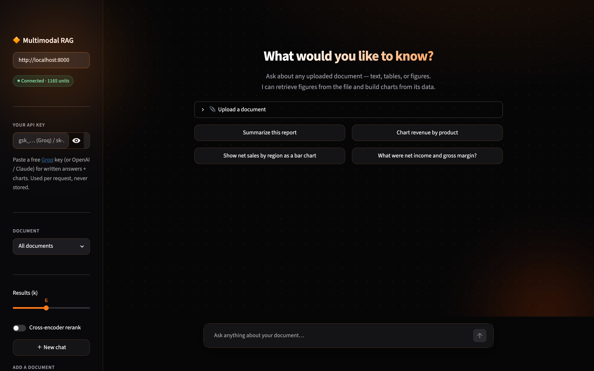
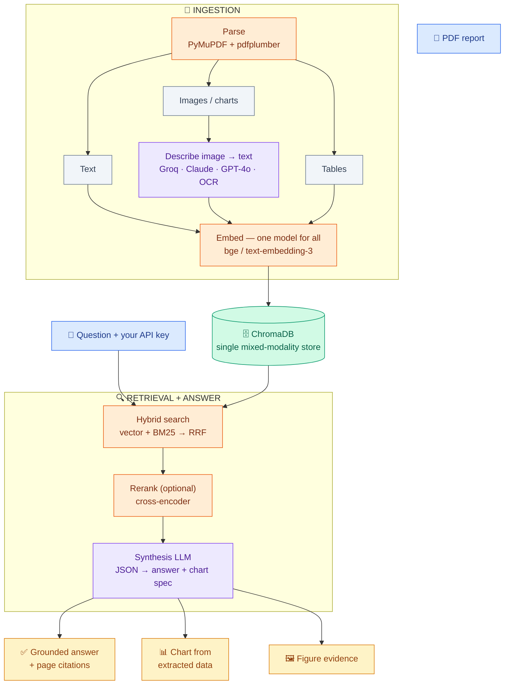

<div align="center">

# 📊 Multimodal RAG — Chat with Financial Reports (Charts Included)

**Ask questions about any PDF report and get grounded answers — from the text, the tables, *and* the charts — with page citations and charts generated on the fly from the document's own numbers.**



</div>

---

## The problem

Standard RAG flattens a PDF into plain text and silently drops **30–40%** of the information — everything inside charts, tables, and diagrams. Ask *"how did iPhone revenue trend?"* and the answer often lives in a figure the system never indexed.

## What it does

Upload a financial report (10-Q, earnings deck, annual report) and:

- 💬 **Ask in plain English** → grounded answers with **page citations**.
- 🖼️ **Figures become searchable** — every chart/table is described and indexed alongside the text, so *"what does Figure 3 show?"* is a valid query.
- 📈 **Charts on demand** — *"chart revenue by product"* extracts the real numbers from the document and renders an interactive Plotly chart.
- 🔑 **Bring your own key** — paste a free Groq (or OpenAI / Claude) key in the UI; used per-request, **never stored**. Runs fully local with no key at all.

---

## Architecture



---

## How it's designed (and why)

| Stage | Decision | Why |
|---|---|---|
| **Parse** | PyMuPDF + pdfplumber → `text` / `image` / `table` elements, each tagged with a page number | Keeps charts/tables as first-class, citable evidence — not thrown away |
| **Describe** | A vision model turns each image into rich text, then we embed *that* | Finds figures by *meaning* — far better than image-similarity (CLIP) for Q&A |
| **Embed** | **One** embedding model for text *and* image/table descriptions | All modalities share one vector space, so cross-modal similarity is comparable |
| **Retrieve** | **Hybrid**: vector (meaning) + BM25 (exact terms) fused with Reciprocal Rank Fusion | Catches both paraphrases *and* literals like "WMT 2014" or "$25,167" |
| **Synthesize** | One JSON call returns the written answer **and** an optional chart spec, with numbers taken verbatim from the retrieved context | Charts are grounded in the document, never hallucinated |
| **Providers** | Auto-detected from `.env`; per-request bring-your-own-key | Runs free/local, upgrades to Groq/Claude/OpenAI with zero code changes |

---

## Results

Evaluated on a **21-query ground-truth set** (answers verified from source text) across **5 real financial reports / 1,165 indexed chunks** — Apple 10-Q, Tesla Q4 earnings deck, and Berkshire Hathaway 2022 / 2023 / Q3-2024 reports. Run with `python tests/eval.py`.

**Retrieval precision @k** — a page containing the answer is in the top-k:

| k | Overall | 10-Q + earnings deck | 440-page annual reports |
|---|---|---|---|
| 5 | 86% | **100%** | 0% |
| 10 | 95% | 100% | 67% |
| 15 | **100%** | 100% | 100% |

- **100% precision on standard-length filings even at k=5.**
- Very long annual reports (300–440 pages) recover fully as `k` grows — a clean illustration of the retrieval-depth vs document-length trade-off.
- **Answer accuracy: 62%** (exact value present in the written answer) on the free 8B model; materially higher with a larger synthesis model.

---

## Quickstart

```bash
brew install tesseract                         # macOS (Ubuntu: apt install tesseract-ocr)
python3 -m venv .venv && source .venv/bin/activate
pip install -r requirements.txt
./run.sh                                        # starts API + chat UI; Ctrl+C stops both
```

Open **http://localhost:8501**, upload a PDF, paste a free [Groq](https://console.groq.com) key in the sidebar, and ask. Try: *"Chart revenue by product"*, *"Compare net sales by region 2026 vs 2025 as a bar chart"*, *"What was net income?"*

```bash
python tests/eval.py --k 5      # reproduce the evaluation
pytest tests/ -q                # smoke tests
```

---

## Project layout

```
ingestion/   parse_pdf · summarize_images · chunk_text
indexing/    embed · store (ChromaDB)
retrieval/   retriever (vector + BM25 + RRF) · reranker
synthesis/   answerer (grounded answers + chart generation)
api/         FastAPI service   ·   ui/  Streamlit chat
tests/       eval_queries.json · eval.py · smoke tests
```

**Stack:** PyMuPDF · pdfplumber · sentence-transformers / OpenAI embeddings · ChromaDB · rank-bm25 · Groq / Claude / GPT-4o · FastAPI · Streamlit · Plotly

---

## Deploying

One-container deploy (API + UI) is set up for **[Hugging Face Spaces](https://huggingface.co/spaces)** via the included `Dockerfile`: create a Space (Docker SDK) and push this repo. For a **public** demo, leave the server keyless — visitors paste their own key, so your quota is never used.

---
