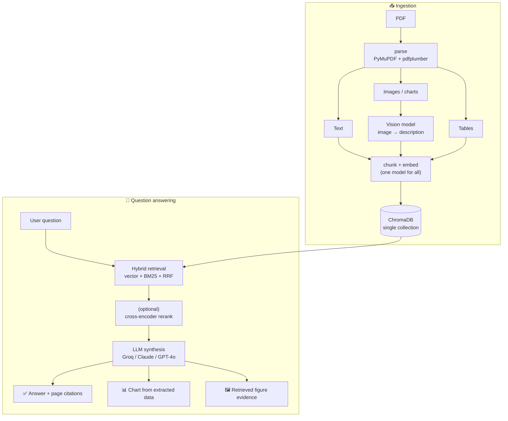

<div align="center">

# 📊 Multimodal RAG — Chat with Your Documents (Charts Included)

**Ask questions about any PDF and get grounded answers — from the text, the tables, *and* the charts. It even builds new charts from the numbers it finds.**

</div>

---

## The problem

Standard RAG flattens a PDF into plain text and silently drops **30–40%** of the information — everything living inside charts, tables, and diagrams. Ask *"how did iPhone revenue trend?"* and the answer often sits in a figure the system never indexed.

## What this does

A Retrieval-Augmented Generation system that understands **both text and visuals**. Upload a financial report (or research paper, manual, contract) and:

- 💬 **Ask in plain English** — get answers grounded in the document, with **page citations**.
- 🖼️ **Figures become searchable** — every chart/diagram is described by a vision model and indexed alongside the text, so *"what does Figure 3 show?"* is a valid query.
- 📈 **Charts on demand** — ask *"chart revenue by product"* and it extracts the real numbers from the document and renders an interactive chart.
- 🆓 **Runs free** — works fully local out of the box; drop in an API key and it auto-upgrades.

---

## How it works



**The key ideas**

| Idea | Why it matters |
|---|---|
| Keep modality + page numbers | Charts/tables aren't lost, and every answer can cite a page |
| Describe images → embed the text | Finds figures by *meaning*, far better than image-similarity for Q&A |
| One embedding model for everything | Text and figures share one vector space, so retrieval is comparable |
| Hybrid retrieval (vector + BM25) | Catches both paraphrases *and* exact terms like "WMT 2014" or "$89B" |
| Provider-agnostic | Free local mode → swap in Groq/Claude/OpenAI via `.env`, no code changes |

---

## Quickstart

```bash
# 1. System dep (PDF/image tooling)
brew install tesseract          # Ubuntu: sudo apt install tesseract-ocr

# 2. Python env
python3 -m venv .venv && source .venv/bin/activate
pip install -r requirements.txt

# 3. (Optional) a free key for written answers + chart reading
cp .env.example .env            # add GROQ_API_KEY=...  (free at console.groq.com)

# 4. Run the whole app (API + chat UI) — Ctrl+C stops both
./run.sh
```

Open **http://localhost:8501**, upload a PDF, and ask away. Try: *"Chart revenue by product"*, *"Summarize this report"*, *"What was net income?"*

> Prefer two terminals? `uvicorn api.main:app --port 8000` and `streamlit run ui/app.py`.

---

## Results

Measured on a ground-truth set (`tests/eval_queries.json`, run via `tests/eval.py`):

| Metric | Result |
|---|---|
| Retrieval precision @5 | **100%** |
| Modality routing (figure surfaced when expected) | **90%** |
| Answer correctness (with LLM synthesis) | **100%** |

---

## Project layout

```
ingestion/   parse_pdf · summarize_images · chunk_text
indexing/    embed · store (ChromaDB)
retrieval/   retriever (vector + BM25 + RRF) · reranker
synthesis/   answerer (answers + chart generation)
api/         FastAPI service  ·  ui/  Streamlit chat
tests/       eval + smoke tests
```

## Tech stack

PyMuPDF · pdfplumber · sentence-transformers / OpenAI embeddings · ChromaDB · rank-bm25 · Groq / Claude / GPT-4o · FastAPI · Streamlit · Plotly

---

## Deploying

- **UI →** [Streamlit Community Cloud](https://streamlit.io/cloud) (free, deploys straight from this repo).
- **API →** any host that runs a process — [Render](https://render.com), [Railway](https://railway.app), or [Hugging Face Spaces](https://huggingface.co/spaces). A `Procfile` is included.
- *Note:* Vercel isn't suitable — Streamlit needs a persistent WebSocket server and the pipeline ships PyTorch + ChromaDB, which don't fit a serverless runtime.

---

<div align="center">
Built as a portfolio project — multimodal RAG for financial-report Q&A.
</div>
